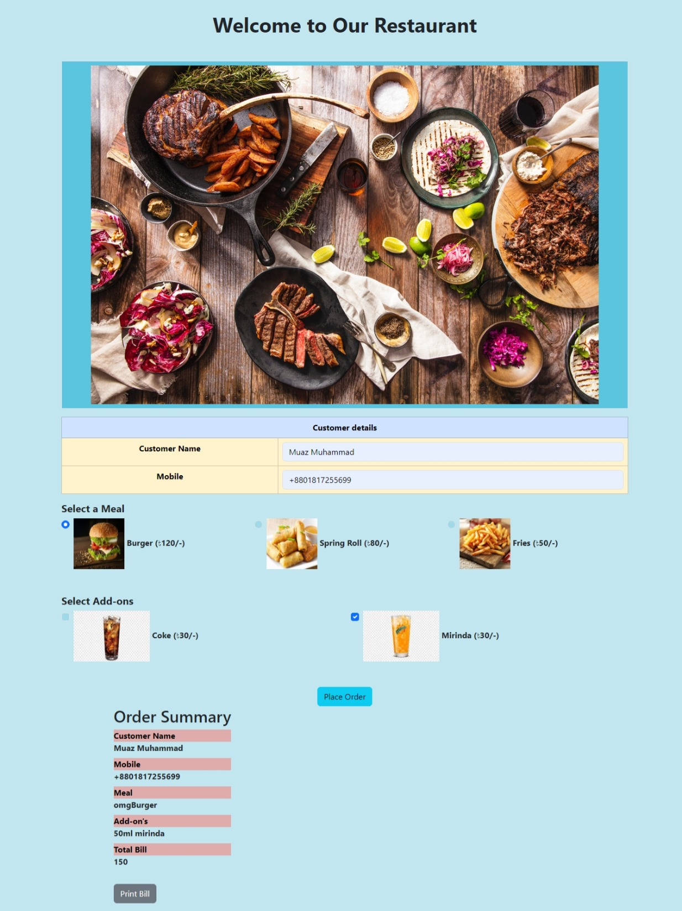

# Food Order Form

A dynamic and responsive food ordering system built using HTML, CSS, and JavaScript. This application features an intuitive interface where users can select meals, add-ons, and view a real-time order summary.



---

## Description

The **Food Order Form** application demonstrates how to create an engaging user interface for food selection and ordering. It uses interactive elements like radio buttons, checkboxes, and dynamic form handling to improve the user experience. The project is styled to make the food menu visually appealing and accessible across devices.

---

## Interesting Techniques

### JavaScript Techniques
1. **Dynamic Order Summary**:
   - Updates the order summary in real-time as users make selections. This is achieved by manipulating the DOM using `innerHTML`.
   - [MDN Reference: Element.innerHTML](https://developer.mozilla.org/en-US/docs/Web/API/Element/innerHTML)
   
2. **Event Handling**:
   - Listens for changes in user input (radio buttons, checkboxes) and updates calculations dynamically.
   - [MDN Reference: addEventListener](https://developer.mozilla.org/en-US/docs/Web/API/EventTarget/addEventListener)

3. **Form Submission Logic**:
   - Prevents default form submission to handle custom behavior like displaying the total bill.
   - [MDN Reference: Event.preventDefault](https://developer.mozilla.org/en-US/docs/Web/API/Event/preventDefault)

4. **Printing the Bill**:
   - Enables printing functionality with the `window.print()` method for a seamless user experience.
   - [MDN Reference: Window.print](https://developer.mozilla.org/en-US/docs/Web/API/Window/print)

### CSS Techniques
1. **Card Design for Menu Items**:
   - Utilizes CSS Flexbox to create responsive, well-aligned cards for food items.
   - [MDN Reference: CSS Flexbox](https://developer.mozilla.org/en-US/docs/Web/CSS/CSS_Flexible_Box_Layout/Basic_Concepts_of_Flexbox)

2. **Hover Effects**:
   - Adds interactive hover effects to food items for better user feedback.
   - [MDN Reference: CSS :hover](https://developer.mozilla.org/en-US/docs/Web/CSS/:hover)

3. **Custom Styling for Forms**:
   - Styles form inputs (text fields, radio buttons, checkboxes) to enhance their visual appeal.

---

## Non-Obvious Technologies and Libraries
1. **Google Fonts**:
   - Fonts Used: [Poppins](https://fonts.google.com/specimen/Poppins), [Roboto](https://fonts.google.com/specimen/Roboto)
   - Integration:
     ```html
     <link href="https://fonts.googleapis.com/css2?family=Poppins:wght@400;600&family=Roboto:wght@300&display=swap" rel="stylesheet">
     ```

2. **Icons and Images**:
   - Uses high-quality images for food items to make the interface visually engaging.
   - Source for placeholder images: [Unsplash](https://unsplash.com/) or [Pexels](https://www.pexels.com/).

---

## Project Structure

```plaintext
/
├── index.html        # Main HTML file for the Food Order Form
├── style.css         # CSS file for styling the application
├── script.js         # JavaScript file for form logic and interactivity
├── assets/           # Directory for images used in the form
└── fonts/            # Directory for any custom fonts (if applicable)
```

### Notable Directories
- **assets/**: Contains images of food items and background visuals used in the form layout.
- **fonts/**: Hosts any locally downloaded font files, though Google Fonts are used via CDN in this project.

---

## Features
1. **Customizable Orders**:
   - Users can select meals, add-ons, and enter personal details like name and contact number.

2. **Real-Time Updates**:
   - Dynamically calculates the total bill and updates the order summary as users make their choices.

3. **Responsive Design**:
   - Optimized for desktop and mobile users with a clean layout and media queries.

4. **Print Order Functionality**:
   - Generates a print-ready summary of the order for convenience.

---

Feel free to explore the [repository](https://github.com/muaz64/Demo-Food-Order-form.git) to learn more about this project or customize it to fit your requirements!

---