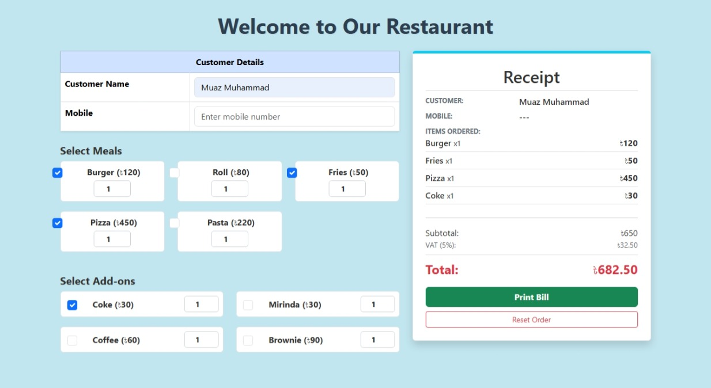

## Restaurant Order Management System

A modern, responsive, and real-time **Food Ordering Web Application** built with HTML5, CSS3, Bootstrap 5, and Vanilla JavaScript. This system allows customers to select multiple meals and drinks, adjust quantities, and generate a professional, print-ready receipt instantly.

---


##  Features

* **Real-time Calculations**: Prices, subtotal, and VAT (5%) update instantly as the user interacts with the form.
* **Multi-item Selection**: Unlike standard forms, this allows selecting multiple categories of food (e.g., Burger, Pizza, and Drinks) in a single order.
* **Quantity Management**: Each item features a dedicated quantity selector to handle bulk orders.
* **Interactive UI**: Smooth hover animations and "Sticky" order summary that follows the user as they scroll.
* **Professional Receipt Printing**: Uses CSS Media Queries to hide the web interface and print only a clean, black-and-white receipt.
* **Form Validation**: The "Print Bill" button is intelligently disabled until a customer name is entered and at least one item is selected.

---

##  Tech Stack

* **Frontend**: HTML5, CSS3 (Custom Media Queries)
* **Framework**: [Bootstrap 5](https://getbootstrap.com/)
* **Logic**: Vanilla JavaScript (ES6+ Array Methods & DOM Manipulation)
* **Icons/Styling**: Poppins Fonts & Font-Awesome (optional)

---

## 📂 Project Structure

```text
├── index.html      # Main application structure
├── style.css       # Custom theme and print-media styling
├── index.js        # Core logic for pricing and real-time updates
└── README.md       # Project documentation

```

---

##  How It Works

### 1. The Menu Array

The system uses a centralized data structure in `index.js` to manage pricing. This makes the system easily scalable:

```javascript
const menuItems = [
    { id: 'optBurger', qtyId: 'qtyBurger', name: 'Burger', price: 120 },
    // easily add more items here...
];

```

### 2. Print Logic

The application uses a specialized CSS print block to ensure the physical receipt looks professional:

```css
@media print {
    body * { visibility: hidden; }
    #orderSummary, #orderSummary * { visibility: visible; }
}

```

---

##  Installation & Usage

1. **Clone the repository**:
```bash
git clone https://github.com/muaz64/Demo-Food-Order-form.git

```


2. **Open the project**:
Simply double-click `index.html` to run the application in any modern web browser.

---

##  License

Distributed under the MIT License. See `LICENSE` for more information.

---


